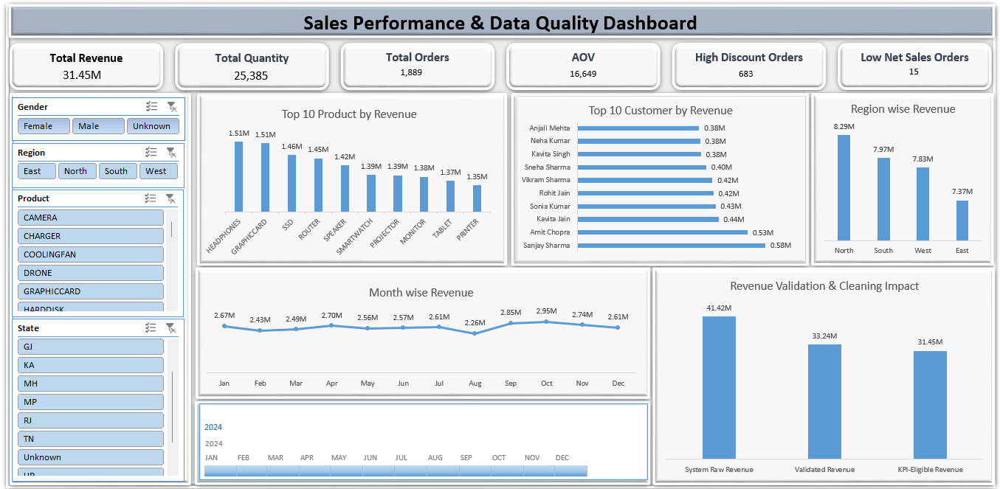
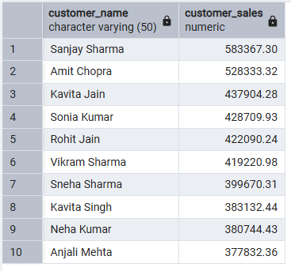

# End-to-End Sales Analytics Project
*From Messy Data to KPI-Ready Revenue — Excel, SQL & Power BI*

---

## 📌 Project Overview

This project demonstrates a real-world end-to-end sales analytics workflow, starting from intentionally messy transactional data and ending with KPI-ready dashboards.

The focus of this project is not just visualization, but strong emphasis on:
- Data quality assessment
- Statistical validation
- KPI governance
- Decision-ready reporting

This closely reflects how sales data is handled in real companies.

---

## 🧠 Business Problem

In real organizations, sales data often contains:

- Duplicate order IDs  
- Missing customer information  
- Invalid quantities or prices (zero / negative values)  
- Extreme outliers in selling price  
- High-discount transactions affecting revenue accuracy  

Using such data directly for reporting can lead to incorrect KPIs and poor business decisions.

This project demonstrates how a data analyst professionally audits, cleans, validates, and governs sales data before reporting.

---

## 🛠 Tools & Technologies

- **Excel**
  - Data audit & validation
  - Statistical analysis (Median, IQR, Upper Limit Capping)
  - KPI logic & pivot analysis
  - Raw vs Clean vs KPI-Eligible revenue comparison dashboard

- **SQL**
  - Data validation checks
  - KPI calculations
  - Revenue analysis by product, customer, region, and month
  - Cross-verification of Excel results

- **Power BI**
  - KPI-ready interactive dashboard
  - Governed and validated reporting layer

- **Statistics**
  - Median-based handling
  - IQR outlier detection
  - Rule-based KPI eligibility logic

---

## 📊 Excel Workflow (Offline Analytical Layer)

Excel was used for deep analytical and audit work, including:

- Raw data inspection (duplicates, missing values, invalid records)
- Statistical outlier detection using the IQR method
- Selling price capping using upper-limit logic
- KPI eligibility rules:
  - High discount exclusion
  - Minimum net sales threshold
- Pivot tables for KPI calculations
- Revenue classification:
  - System Raw Revenue
  - Clean / Validated Revenue
  - KPI-Eligible Revenue

**Note:**  
Detailed audit sheets and full raw datasets are intentionally kept offline to protect original analytical work.

📷 **Excel Dashboard Preview:**  

---

## 🗄 SQL Workflow (Validation & Cross-Check Layer)

SQL was used to:

- Validate cleaned and KPI-eligible datasets
- Recalculate key KPIs independently
- Cross-check Excel-derived metrics
- Analyze top products, customers, regions, and monthly trends

This ensures logic accuracy and consistency across tools.

📷 **SQL Validation Example:**  

---

## 📈 Power BI Dashboard (KPI-Ready Reporting Layer)

The Power BI dashboard is built only on validated and KPI-eligible data, ensuring reliable and decision-grade reporting.

### Key KPIs

- KPI-Eligible Revenue: **31.45M**
- Total Orders: **1,889**
- Average Order Value (AOV): **16.65K**
- Excluded Revenue (%): **5.38%**
- KPI-Eligible Orders (%): **95.31%**

### Key Visuals

- Top 10 Products by KPI-Eligible Revenue
- Revenue by Region (Validated Data)
- KPI-Eligible Revenue Trend (2024)
- KPI Eligibility Breakdown
- Data Cleaning Impact on Revenue

📷 **Power BI Dashboard Preview:**  

---

## 📌 Key Business Insights

- Over 95% of orders meet KPI eligibility criteria
- 5.38% of revenue is excluded due to validation rules
- North region contributes the highest validated revenue
- Headphones and Graphic Cards are top-performing products
- October shows peak KPI-eligible revenue

---

## 🧪 About the Data

The datasets used in this project were synthetically created to closely mimic real-world company data.

Intentional data challenges included:

- Duplicate order IDs
- Missing customer IDs and unknown customers
- Missing state or demographic information
- Negative or zero quantity and selling price
- Extreme high-value outliers
- Discounts ranging from 0% to 70%

Orders with missing customer information were retained as valid transactions and categorized under **"Unknown Customer"**, reflecting real business scenarios where sales occur but customer details are unavailable.

Raw, cleaned, and KPI-eligible datasets are not publicly shared to protect original analytical work.

---

## ✅ Final Note for Recruiters

- Excel demonstrates strong data quality thinking and statistical validation
- SQL ensures logic accuracy and independent KPI verification
- Power BI delivers clean, governed, KPI-ready dashboards

This project reflects how a real data analyst works in production environments — not just how charts are created.

---

## 📁 Repository Contents

- Dashboard screenshots (Excel & Power BI)
- SQL validation queries
- Raw sample dataset (structure reference only)
- concise project summary is also available in PDF format.
- README.md
